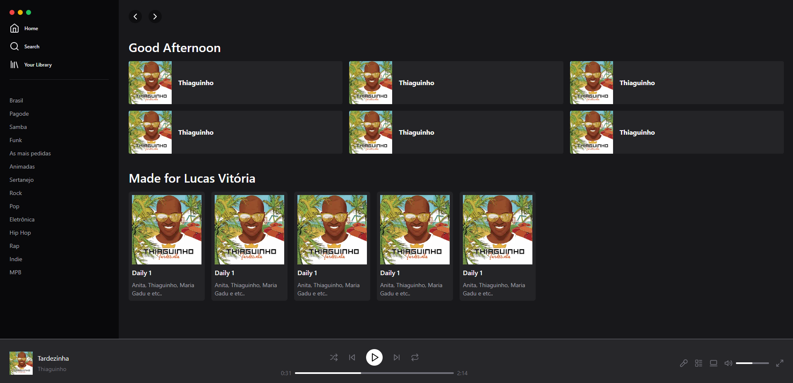

# Clone do Spotify - Frontend

<!-- Imagem centralizada do logo do Spotify -->

  

Este é o frontend fixo do Spotify, uma aplicação web inspirada no famoso serviço de streaming de música. Neste projeto, criei a interface do usuário do Spotify utilizando React, permitindo aos usuários visualizarem a interface sem a funcionalidade completa do serviço.

## Recursos

- Interface do usuário inspirada no Spotify.
- Visualização de artistas, álbuns e músicas.

## Pré-requisitos

Antes de executar o frontend, verifique se você tem o Node.js instalado na sua máquina.

## Tecnologias

- react
- tailwind
- lucide-react
- typescript

## Instalação

- clone o repo

~~~javascript
 git@github.com:Lvitoria/React-Spotify-Tailwind.git
~~~

- instale as dependências
~~~javascript
 npm i 
~~~

- rodar o servidor
~~~javascript
 npm run dev
~~~

## Print do frontend

<!-- Imagem centralizada do logo do sistema -->

  

